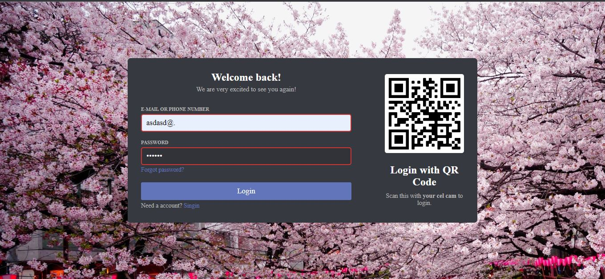
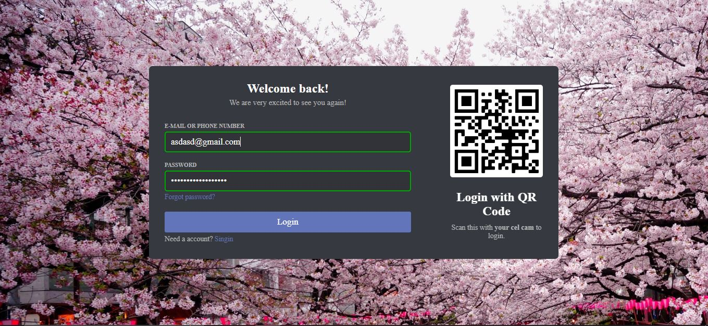

This is project of a login screen design inspired by the Discord web login screen with Javascript validation.
 

 
The project was made to validate the email, the phone number (validation is only for brazilian phone numbers) and if the password has the minimum of characters.
 

 
And when the validation gives an error and the person corrects it, it changes the color to a green, saying it's right.
 
